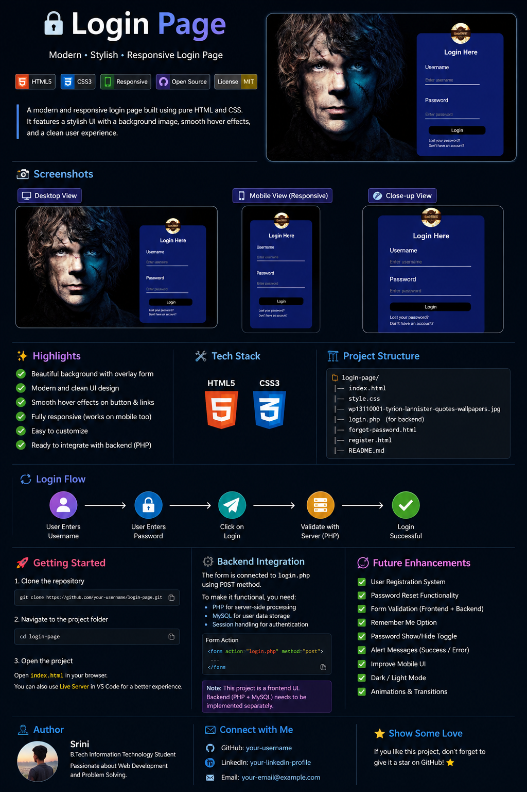

<div align="center">

# 🔐 Login Page

### Modern • Stylish • Game of Thrones Inspired

A clean **HTML5 + CSS3 login page** with a cinematic background, centered login form, hover effects, and a simple frontend structure.

</div>

---

## 🎨 Project Showcase

<div align="center">



</div>

---

## 🖥️ Actual Project Preview

<div align="center">


</div>

---

## ✨ Features

- 🔐 Username & password fields
- 🖼️ Cinematic full-screen background
- 🎨 Styled login card with rounded corners
- 👤 Circular logo
- 🖱️ Button and link hover effects
- 🔗 Forgot password link
- 📝 Registration link
- ⚡ Lightweight HTML & CSS implementation
- 🧩 Ready for PHP backend integration

---

## 🛠️ Tech Stack

<p align="center">
  
</p>

| Technology | Usage |
|---|---|
| HTML5 | Page structure and form |
| CSS3 | Layout, colors, background and effects |

---

## 📂 Project Structure

```text
Login-Page/
│
├── index.html
├── style.css
├── login-page-preview.png
├── readme-showcase.png
├── forgot-password.html
├── register.html
└── README.md
```

---

## 🚀 Run Locally

```bash
git clone https://github.com/your-username/login-page.git
cd login-page
```

Then open **`index.html`** in your browser.

> 💡 For development, use VS Code **Live Server**.

---

## 🔐 Login Flow

```text
Username
    ↓
Password
    ↓
   Login
    ↓
login.php
    ↓
Backend Authentication
```

The current project is primarily a **frontend UI**. Real authentication requires a backend such as **PHP + MySQL**.

---

## 🔮 Future Improvements

- [ ] PHP + MySQL authentication
- [ ] User registration
- [ ] Forgot password functionality
- [ ] Form validation
- [ ] Password show/hide toggle
- [ ] Success & error messages
- [ ] Improved mobile responsiveness
- [ ] Accessibility improvements

---

## 👨‍💻 Author

**Srini**  
B.Tech Information Technology Student

---

<div align="center">

⭐ **If you like this project, give the repository a star!**

**Built with ❤️ using HTML & CSS**

</div>
